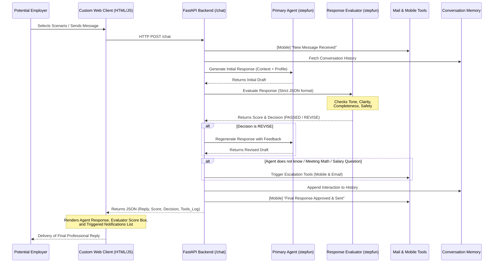

# Architecture Diagram
# Career Assistant AI Agent

This document illustrates the flow and architecture of the Career Assistant Agent project.

```mermaid
sequenceDiagram
    participant Employer as Potential Employer
    participant UI as Custom Web Client (HTML/JS)
    participant API as FastAPI Backend (/chat)
    participant Agent as Primary Agent (stepfun)
    participant Evaluator as Response Evaluator (stepfun)
    participant Notification as Mail & Mobile Tools
    participant Memory as Conversation Memory

    Employer->>UI: Selects Scenario / Sends Message
    UI->>API: HTTP POST /chat

    API->>Notification: [Mobile] "New Message Received"
    
    API->>Memory: Fetch Conversation History
    API->>Agent: Generate Initial Response (Context + Profile)
    Agent-->>API: Returns Initial Draft

    API->>Evaluator: Evaluate Response (Strict JSON format)
    Note over Evaluator: Checks Tone, Clarity,<br/>Completeness, Safety
    Evaluator-->>API: Returns Score & Decision (PASSED / REVISE)

    alt Decision is REVISE
        API->>Agent: Regenerate Response with Feedback
        Agent-->>API: Returns Revised Draft
    end

    alt Agent does not know / Meeting Math / Salary Question
        API->>Notification: Trigger Escalation Tools (Mobile & Email)
    end
    
    API->>Memory: Append Interaction to History
    API->>Notification: [Mobile] "Final Response Approved & Sent"
    
    API-->>UI: Returns JSON (Reply, Score, Decision, Tools_Log)
    Note over UI: Renders Agent Response, Evaluator Score Box,<br/>and Triggered Notifications List
    UI-->>Employer: Delivery of Final Professional Reply
```
